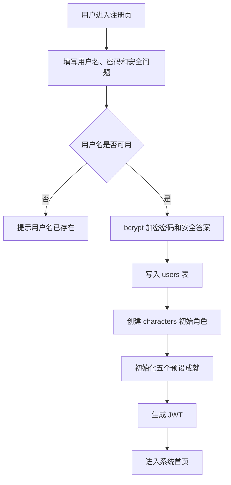
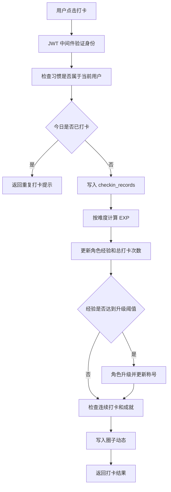
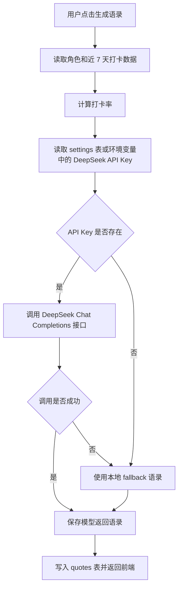

# 自律达人 - 产品需求文档

## 1. 产品概述

"自律达人"是一款基于游戏化机制的习惯养成与打卡系统，将早起、背单词、运动等日常习惯转化为 RPG 游戏任务。用户通过完成打卡获得经验值，提升虚拟角色等级，解锁成就称号，并可在打卡圈子中与好友互相监督。系统已实现 AI 语录生成、用户中心、管理员后台和调试模式等扩展能力，适合课程项目展示与本地/云端部署演示。

## 2. 用户角色

| 角色 | 注册方式 | 核心权限 |
|------|----------|----------|
| 普通用户 | 用户名、密码、安全问题 | 创建习惯、打卡、查看角色、加入圈子、生成 AI 语录、维护个人安全信息 |
| 圈子管理员 | 圈子创建者提升 | 邀请成员、踢出成员、提升或降级成员、维护圈子秩序 |
| 圈子创建者 | 创建圈子自动获得 | 管理圈子、删除圈子、分配管理员 |
| 系统管理员 | 管理密钥注册或后台配置 | 管理用户、重置密码/安全问题、删除用户、重置角色、维护全局 AI Key |

## 3. 核心功能

### 3.1 首页仪表盘

首页展示用户今日习惯完成情况、角色等级、称号、经验值进度、连续打卡信息和 AI 每日语录。用户登录后可直接从首页完成主要打卡操作，减少跳转成本。

### 3.2 用户认证与账户安全

系统支持用户注册、登录、Token 验证、忘记密码、安全问题验证、密码重置和账户注销。登录失败次数会记录到数据库，连续失败后可配合锁定时间限制异常登录行为。前端支持 URL Token 优先级机制，便于多标签页使用不同用户身份演示。

### 3.3 习惯管理

用户可以创建、编辑、删除习惯任务。习惯包含名称、图标、难度等级、频率和提醒时间等属性。难度等级用于计算打卡获得的基础经验值。

### 3.4 打卡与记录

用户可对今日习惯执行一键打卡。系统会检查是否重复打卡，写入打卡记录，计算经验值，更新角色等级、连续打卡天数和成就状态。打卡页面提供今日状态、历史记录和日历热力图展示。

### 3.5 虚拟角色与成就

角色系统包含等级、经验值、称号、连续打卡天数、最高连续天数、总打卡次数和成就列表。系统预置"初出茅庐"、"持之以恒"、"早起达人"、"全能选手"、"百天传奇"五类成就，并根据打卡行为自动解锁。

### 3.6 打卡圈子

用户可以创建圈子、通过邀请码加入圈子、查看成员列表和动态记录。圈子支持邀请其他用户、处理邀请、退出圈子、删除圈子，以及创建者/管理员/成员三级角色权限。用户打卡后会生成圈子动态，用于好友监督。

### 3.7 AI 语录

系统根据用户等级、称号、连续打卡天数、近 7 天打卡率和总打卡次数构建 Prompt，调用 DeepSeek API 生成 RPG 风格的个性化鼓励或警示语录。若未配置 API Key 或接口调用失败，系统会使用本地 fallback 语录保障功能可用。

### 3.8 用户中心

用户中心支持修改密码、设置或更新安全问题、查看安全信息、修改时区和注销账户。时区信息保存到用户表，并在前端状态中持久化。

### 3.9 管理员后台

管理员后台面向系统管理员开放，支持用户列表、用户详情、重置用户密码、重置安全问题、删除用户、重置角色数据，以及维护全局设置。DeepSeek API Key 可保存到 settings 表，优先级高于环境变量。

### 3.10 调试模式

调试模式用于课程演示和功能验证。系统支持保存/恢复调试快照、修改角色属性、添加测试打卡、清除打卡记录、解锁或重新锁定成就，并通过前端 Debug 面板和请求头控制调试时间偏移。

## 4. 页面详情

| 路由 | 页面 | 主要功能 |
|------|------|----------|
| / | 首页仪表盘 | 今日概览、角色信息、经验值进度、AI 语录 |
| /login | 登录页 | 用户名密码登录、登录状态写入全局 Store |
| /register | 注册页 | 注册账号并初始化角色和成就 |
| /forgot-password | 忘记密码页 | 获取安全问题、验证答案、重置密码 |
| /habits | 习惯管理 | 习惯列表、创建、编辑、删除 |
| /checkin | 打卡页面 | 今日打卡状态、打卡记录、热力图 |
| /character | 虚拟角色 | 等级、经验、称号、连续天数、成就墙 |
| /circles | 圈子列表 | 创建圈子、加入圈子、查看邀请 |
| /circles/:id | 圈子详情 | 成员管理、邀请、排行榜、动态 |
| /quotes | AI 语录 | 生成语录、查看历史语录 |
| /user-center | 用户中心 | 密码、安全问题、时区、注销账户 |
| /admin | 管理员后台 | 用户管理、角色重置、全局设置 |

## 5. 核心流程

### 5.1 用户注册与初始化流程

### 5.2 打卡核心流程

### 5.3 AI 语录生成流程

## 6. 界面与交互设计

系统当前实际样式更接近 Material Design 3 与轻量游戏化融合，而不是纯暗黑奇幻风格。Tailwind 配置使用 CSS 变量定义 md 色彩系统，支持暗色模式，提供圆角、阴影和动画扩展。导航栏包含首页、习惯、打卡、角色、圈子、语录六个主入口，右侧提供用户等级展示、主题切换、调试面板、用户中心、管理员后台和退出登录。

## 7. 游戏化机制

| 难度等级 | 基础经验值 | 说明 |
|----------|------------|------|
| 1 星 | 10 EXP | 低难度习惯 |
| 2 星 | 20 EXP | 日常轻量任务 |
| 3 星 | 30 EXP | 中等坚持成本 |
| 4 星 | 50 EXP | 较高难度任务 |
| 5 星 | 80 EXP | 高挑战习惯 |

升级所需经验值按当前等级递增，基础规则为"等级 × 100"。系统通过经验值、等级、称号、成就和圈子动态把单次打卡转化为可持续的成长反馈。

## 8. 数据与安全需求

- 密码和安全答案使用 bcryptjs 哈希存储。
- JWT 默认有效期为 7 天。
- 需要认证的接口统一读取 Authorization Bearer Token。
- 写操作完成后自动保存 sql.js 内存数据库到 data/app.db。
- 用户数据通过外键约束与级联删除维护一致性。
- 管理员功能需要 is_admin 标记，普通用户不可访问后台接口。
