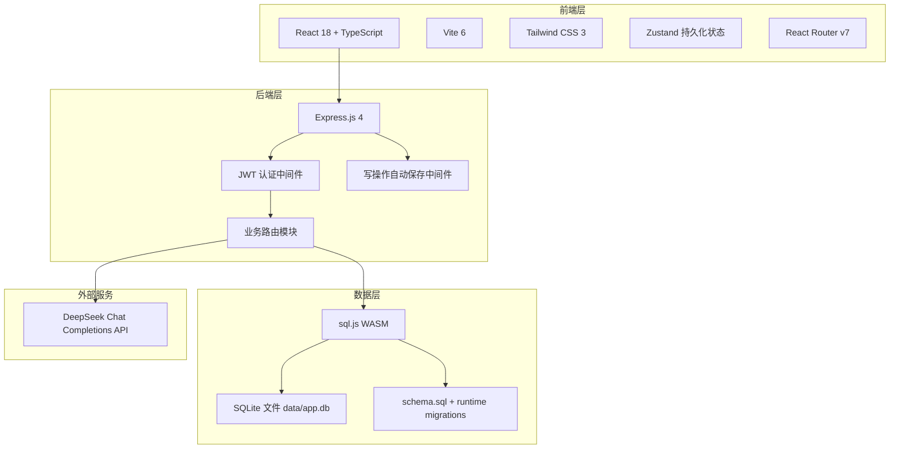
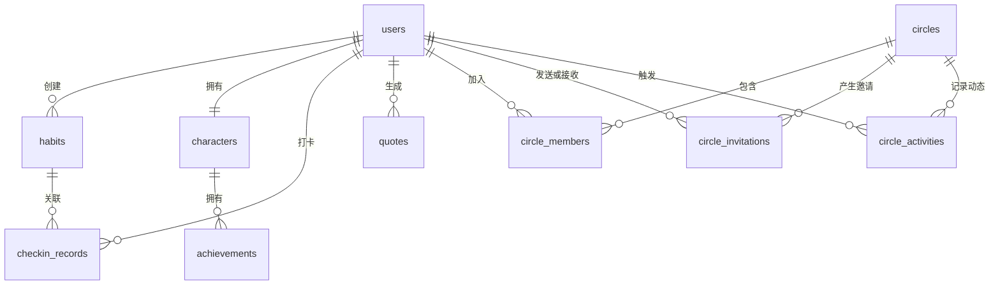

# 自律达人 - 技术架构文档

## 1. 架构设计

## 2. 技术选型

| 分类 | 实际技术 | 版本/来源 | 说明 |
|------|----------|-----------|------|
| 前端框架 | React | 18.3.1 | 组件化构建单页应用 |
| 开发语言 | TypeScript | 5.8.3 | 前后端统一类型约束 |
| 构建工具 | Vite | 6.3.5 | 前端开发服务器和生产构建 |
| 前端路由 | react-router-dom | 7.3.0 | 12 个页面路由和 Layout 嵌套路由 |
| 状态管理 | Zustand | 5.0.3 | 全局状态、localStorage 持久化 |
| UI 样式 | Tailwind CSS | 3.4.17 | Material Design 3 风格变量、暗色模式 |
| 后端框架 | Express.js | 4.21.2 | RESTful API 服务 |
| 数据库 | sql.js | 1.12.0 | SQLite WASM，封装为类 better-sqlite3 API |
| 认证 | jsonwebtoken | 9.0.2 | JWT Token，默认 7 天有效期 |
| 密码加密 | bcryptjs | 2.4.3 | 密码和安全答案哈希 |
| 图标 | lucide-react | 0.511.0 | 导航和功能图标 |
| 部署支持 | Vercel / SEA | @vercel/node、nexe、esbuild | 支持 Serverless 和单文件打包思路 |

## 3. 前端路由

| 路由 | 页面组件 | 说明 |
|------|----------|------|
| / | Home.tsx | 首页仪表盘 |
| /login | Login.tsx | 登录 |
| /register | Register.tsx | 注册 |
| /forgot-password | ForgotPassword.tsx | 忘记密码 |
| /habits | Habits.tsx | 习惯管理 |
| /checkin | Checkin.tsx | 打卡 |
| /character | Character.tsx | 虚拟角色 |
| /circles | Circles.tsx | 圈子列表 |
| /circles/:id | CircleDetail.tsx | 圈子详情 |
| /quotes | Quotes.tsx | AI 语录 |
| /user-center | UserCenter.tsx | 用户中心 |
| /admin | Admin.tsx | 管理员后台 |

## 4. 后端路由

后端在 app.ts 中挂载 10 个业务路由模块和健康检查接口。除注册、登录、忘记密码、健康检查外，多数接口需要 JWT 认证。

| 路由前缀 | 路由文件 | 主要接口 |
|----------|----------|----------|
| /api/auth | auth.ts | 注册、登录、安全问题、答案验证、重置密码、/me |
| /api/auth/admin | auth.ts | 管理员注册 |
| /api/habits | habits.ts | 获取、创建、编辑、删除习惯 |
| /api/checkin | checkin.ts | 打卡、今日状态、历史记录 |
| /api/character | character.ts | 获取角色信息和成就 |
| /api/circles | circles.ts | 圈子列表、创建、加入、邀请、权限、退出、删除 |
| /api/quotes | quotes.ts | 语录列表、生成语录 |
| /api/users | users.ts | 用户搜索 |
| /api/user-center | user-center.ts | 密码、安全问题、时区、注销 |
| /api/debug | debug.ts | 调试快照、角色修改、测试打卡、成就控制 |
| /api/admin | admin.ts | 用户管理、重置、设置管理 |
| /api/health | app.ts | 健康检查 |

## 5. 数据库设计

数据库使用 sql.js 加载 SQLite WASM，实际文件保存为 data/app.db。database.ts 封装 Statement 和 Database 类，提供 prepare().get()、prepare().all()、prepare().run()、exec()、saveToDisk() 等接口，便于路由层以接近 better-sqlite3 的方式访问数据库。

### 5.1 数据表

| 表名 | 用途 | 关键字段 |
|------|------|----------|
| users | 用户与账户安全 | username、password、is_admin、security_question、failed_attempts、locked_until、timezone |
| habits | 习惯任务 | user_id、name、icon、difficulty、frequency、reminder_time |
| checkin_records | 打卡记录 | user_id、habit_id、checked_at、exp_gained |
| characters | 虚拟角色 | level、exp、title、current_streak、max_streak、total_checkins、last_penalty_date |
| achievements | 成就 | character_id、name、description、icon、unlocked_at |
| circles | 圈子 | name、invite_code、creator_id |
| circle_members | 圈子成员 | circle_id、user_id、role |
| circle_invitations | 圈子邀请 | sender_id、receiver_id、status |
| debug_snapshots | 调试快照 | user_id、character_data、checkin_max_id |
| circle_activities | 圈子动态 | circle_id、user_id、habit_name、checked_at |
| quotes | AI 语录 | user_id、content、type、generated_at |
| settings | 全局配置 | key、value |

### 5.2 ER 图

## 6. 认证与状态管理

JWT 中间件从 Authorization 请求头中读取 Bearer Token，验证成功后把 userId 写入 req 对象。中间件还读取 X-Debug-Mode 和 X-Debug-Time-Offset 两个请求头，为调试模式提供时间偏移能力。前端 store.ts 通过 Zustand persist 中间件保存 user、darkMode、timezone，并通过 headers() 统一注入 Token 和 Debug 请求头。

## 7. 数据持久化机制

sql.js 本质上是内存数据库。系统在 app.ts 中注册 /api 中间件，拦截 res.end；当请求方法为 POST、PUT、PATCH、DELETE 时，响应结束前调用 getDb().saveToDisk()，把内存数据库导出为 SQLite 文件并写入 data/app.db。database.ts 在启动时读取已有数据库文件，不存在时创建空数据库并执行 schema.sql。

## 8. AI 接口设计

系统使用 DeepSeek Chat Completions API。API Key 优先从 settings 表读取，若不存在再从 DEEPSEEK_API_KEY 环境变量读取。Prompt 根据角色等级、称号、连续打卡、近 7 天打卡率和总打卡次数生成。语录类型包含 encourage 与 warning，接口失败时使用本地 fallback 文案。

## 9. 构建与运行

| 命令 | 说明 |
|------|------|
| npm run dev | 同时启动前端 Vite 和后端 nodemon |
| npm run client:dev | 仅启动前端 |
| npm run server:dev | 仅启动后端 |
| npm run build | TypeScript 编译并执行 Vite 构建 |
| npm run preview | 预览生产构建 |
| npm run check | TypeScript 类型检查 |
| npm run lint | ESLint 检查 |

Vite 配置使用 @vitejs/plugin-react、vite-tsconfig-paths 和 vite-plugin-trae-solo-badge，并把 /api 代理到本地后端 3001 端口。生产环境下 Express 会尝试托管 dist 目录，非 API 路径回退到 index.html 以支持 SPA 路由刷新。
