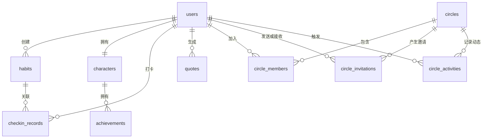

# 自律达人 · SelfDiscipline Master

> 把日常习惯变成 RPG 任务的轻量化游戏化打卡系统。
> 早起、背单词、运动……一次打卡 = 经验值 + 升级 + 解锁成就 + 圈子动态。

[](https://github.com/star-picker/zilvdaren)
[](#许可证)
[](https://react.dev)
[](https://expressjs.com)
[-003B57?logo=sqlite)](https://github.com/sql-js/sql.js)
[](#ai-语录)

---

## 目录

- [项目简介](#项目简介)
- [核心特性](#核心特性)
- [技术栈](#技术栈)
- [项目结构](#项目结构)
- [快速开始](#快速开始)
- [环境变量](#环境变量)
- [页面与路由](#页面与路由)
- [后端 API 概览](#后端-api-概览)
- [数据库设计](#数据库设计)
- [游戏化机制](#游戏化机制)
- [AI 语录](#ai-语录)
- [调试模式](#调试模式)
- [部署](#部署)
- [常见问题](#常见问题)
- [贡献指南](#贡献指南)
- [许可证](#许可证)

---

## 项目简介

**自律达人**是一款面向学生和自我提升人群的「游戏化习惯养成」Web 应用。
系统把早起、背单词、运动等枯燥的日常行为，转化为 RPG 风格的成长曲线：

- 每次打卡获得经验值（EXP）
- 经验值累积 → 角色升级 → 解锁新称号
- 连续打卡 → 解锁成就（初出茅庐 / 持之以恒 / 早起达人 / 全能选手 / 百天传奇）
- 加入「打卡圈子」→ 与好友互相监督、查看动态
- 一键生成 DeepSeek 个性化鼓励/警示语录

目标用户：需要建立稳定习惯、想要持续正反馈、喜欢轻量化游戏体验的个人和学习型团队。

> 适合作为大三大四课程设计 / 毕业设计 / 个人作品集。

---

## 核心特性

| 模块 | 能力 |
|------|------|
| 🏠 首页仪表盘 | 今日习惯完成情况、角色等级 / 经验进度、连续打卡天数、AI 每日语录 |
| 🔐 账户安全 | 注册、登录、JWT 验证、忘记密码、安全问题 + 答案重置、登录失败次数锁定 |
| 🎯 习惯管理 | 自定义图标、1–5 星难度、频率、提醒时间 |
| ✅ 一键打卡 | 自动去重、按难度计算 EXP、自动升级、检查连续 / 成就、写入圈子动态 |
| 🧙 虚拟角色 | 等级、经验、称号、连续天数、最高连续、总打卡数、成就墙 |
| 👥 打卡圈子 | 创建圈子、邀请码加入、创建者 / 管理员 / 成员三级权限、动态流 |
| 🤖 AI 语录 | 基于角色状态生成 RPG 风格鼓励 / 警示，DeepSeek 失败时本地 fallback |
| 👤 用户中心 | 修改密码、设置安全问题、修改时区、注销账户 |
| 🛠 管理员后台 | 用户列表 / 详情、重置密码 / 安全问题、删除用户、重置角色、全局 AI Key 管理 |
| 🧪 调试模式 | 保存 / 恢复快照、修改角色属性、注入测试打卡、解锁 / 锁定成就、时间偏移请求头 |
| 🌗 主题 | 浅色 / 暗色切换（Material Design 3 风格） |
| 🌐 部署 | Vercel Serverless、本地 Node、单文件 SEA 打包三种思路均已留口 |

---

## 技术栈

### 前端
- **React 18.3.1** + **TypeScript 5.8.3**
- **Vite 6.3.5**（HMR、构建、代理 `/api → http://localhost:3001`）
- **react-router-dom 7.3.0**（12 个页面，嵌套 Layout）
- **Zustand 5.0.3**（全局状态 + `localStorage` 持久化）
- **Tailwind CSS 3.4.17**（CSS 变量实现 Material Design 3 风格 + 暗色模式）
- **lucide-react 0.511.0**（图标）

### 后端
- **Express 4.21.2** + **CORS**
- **JWT (jsonwebtoken 9.0.2)** — 默认 7 天有效期
- **bcryptjs 2.4.3** — 密码 / 安全问题答案哈希
- **dotenv** — 环境变量

### 数据 & 外部服务
- **sql.js 1.12.0**（SQLite WASM，写操作自动落盘到 `data/app.db`）
- **DeepSeek Chat Completions**（个性化语录，含本地 fallback）

### 工程化
- **ESLint 9** + **typescript-eslint 8**
- **concurrently** 一键同时启动前后端
- **nodemon** 监听 `api/` 热重启
- **Vercel** rewrites（生产环境托管 dist + Serverless API）

---

## 项目结构

```text
zilvdaren/
├── api/                       # 后端 Express 服务
│   ├── server.ts              # 本地启动入口（端口 3001）
│   ├── app.ts                 # Express 装配：路由、中间件、写操作自动落盘
│   ├── index.ts               # Vercel Serverless 入口
│   ├── db/
│   │   ├── database.ts        # sql.js 封装（类 better-sqlite3 API）
│   │   └── schema.sql         # 表结构
│   ├── middleware/auth.ts     # JWT + Debug 请求头中间件
│   └── routes/                # 业务路由模块
│       ├── auth.ts            # 注册 / 登录 / 安全问题 / 重置密码 / 管理员注册
│       ├── habits.ts          # 习惯 CRUD
│       ├── checkin.ts         # 打卡核心
│       ├── character.ts       # 角色信息、成就
│       ├── circles.ts         # 圈子、成员、邀请、动态
│       ├── quotes.ts          # AI 语录
│       ├── users.ts           # 用户搜索
│       ├── user-center.ts     # 密码、问题、时区、注销
│       ├── admin.ts           # 后台用户管理、设置
│       └── debug.ts           # 调试快照、时间偏移、测试数据
├── src/                       # 前端
│   ├── App.tsx                # 路由 + Layout
│   ├── main.tsx               # 入口
│   ├── store.ts               # Zustand 持久化 + URL Token 优先级
│   ├── pages/                 # 12 个页面
│   ├── components/            # Layout、DebugPanel、Empty
│   ├── hooks/                 # useTheme、useDebugMode
│   ├── lib/                   # utils
│   └── utils/                 # formatDate
├── data/                      # 运行时数据库（被 .gitignore）
├── dist-build/                # SEA 单文件打包产物（被 .gitignore）
├── .trae/documents/           # 内部 PRD / 技术文档
├── vite.config.ts             # Vite 配置 + /api 代理
├── nodemon.json               # 后端热重启
├── vercel.json                # Vercel 路由重写
└── package.json
```

---

## 快速开始

### 环境要求
- Node.js **≥ 18**（推荐 20+）
- npm **≥ 9**（或 pnpm / yarn）

### 安装依赖
```bash
npm install
```

### 启动开发服务器（前端 + 后端）
```bash
npm run dev
```
- 前端：`http://localhost:5173`
- 后端：`http://localhost:3001`
- 前端通过 Vite proxy 自动把 `/api/*` 转发到后端

### 分别启动
```bash
npm run client:dev   # 仅 Vite
npm run server:dev   # 仅后端 nodemon
```

### 生产构建 & 预览
```bash
npm run build        # tsc -b && vite build
npm run preview      # 本地预览 dist
```

### 类型检查 & Lint
```bash
npm run check        # tsc --noEmit
npm run lint         # eslint .
```

---

## 环境变量

在项目根目录创建 `.env`（已被 `.gitignore`，**不要提交**）：

```dotenv
# DeepSeek API Key（可选；也可在管理员后台 → 设置中维护，优先级高于此环境变量）
DEEPSEEK_API_KEY=sk-xxxxxxxxxxxxxxxxxxxxxxxxxxxxxxxx

# 后端端口（默认 3001）
PORT=3001

# 管理员注册密钥（/api/auth/admin 注册管理员时校验）
ADMIN_REG_KEY=your-admin-register-key
```

> ⚠️ **安全提示**：`.env` 含敏感信息，已通过 `.gitignore` 排除在仓库外。如果你不小心把它推上去，**请立即在 DeepSeek 控制台重置 Key**，因为 git 历史是不可逆的。

---

## 页面与路由

| 路由 | 页面 | 主要功能 |
|------|------|----------|
| `/` | 首页仪表盘 | 今日概览、角色信息、AI 语录、快速打卡 |
| `/login` | 登录 | 用户名密码登录、登录状态写入全局 Store |
| `/register` | 注册 | 注册并自动初始化角色和成就 |
| `/forgot-password` | 忘记密码 | 取安全问题 → 验证答案 → 重置密码 |
| `/habits` | 习惯管理 | 习惯列表、创建、编辑、删除 |
| `/checkin` | 打卡 | 今日状态、记录、日历热力图 |
| `/character` | 虚拟角色 | 等级、经验、称号、连续天数、成就墙 |
| `/circles` | 圈子列表 | 创建、加入、查看邀请 |
| `/circles/:id` | 圈子详情 | 成员管理、邀请、排行榜、动态 |
| `/quotes` | AI 语录 | 生成语录、查看历史 |
| `/user-center` | 用户中心 | 密码、安全问题、时区、注销 |
| `/admin` | 管理员后台 | 用户管理、角色重置、全局设置（需 `is_admin=1`） |

> 前端支持 **URL Token 优先级**（`store.ts`）：可通过 `?token=xxx` 在多标签页演示不同身份。

---

## 后端 API 概览

所有需要认证的接口统一从 `Authorization: Bearer <jwt>` 读取身份。
Debug 模式通过 `X-Debug-Mode: 1` 和 `X-Debug-Time-Offset: <ms>` 两个请求头控制时间偏移。

| 路由前缀 | 文件 | 主要接口 |
|----------|------|----------|
| `/api/auth` | `auth.ts` | `POST /register`、`POST /login`、`POST /forgot-question`、`POST /forgot-verify`、`POST /reset-password`、`GET /me` |
| `/api/auth/admin` | `auth.ts` | 管理员注册（需 `ADMIN_REG_KEY`） |
| `/api/habits` | `habits.ts` | `GET /`、`POST /`、`PUT /:id`、`DELETE /:id` |
| `/api/checkin` | `checkin.ts` | `POST /`（打卡）、`GET /today`、`GET /history` |
| `/api/character` | `character.ts` | `GET /`（含成就列表） |
| `/api/circles` | `circles.ts` | `GET /`、`POST /`、`POST /join`、`POST /:id/invite`、`DELETE /:id/members/:userId`、`POST /leave`、`DELETE /:id` |
| `/api/quotes` | `quotes.ts` | `GET /`、`POST /generate` |
| `/api/users` | `users.ts` | 用户搜索（用于邀请） |
| `/api/user-center` | `user-center.ts` | 改密、改问题、时区、注销 |
| `/api/debug` | `debug.ts` | 快照保存/恢复、角色属性修改、测试打卡、成就解锁 / 锁定 |
| `/api/admin` | `admin.ts` | 用户管理、重置密码 / 问题 / 角色、设置管理 |
| `/api/health` | `app.ts` | 健康检查 |

### 写操作自动落盘
`app.ts` 中间件在 `POST / PUT / PATCH / DELETE` 的 `res.end()` 之前调用
`getDb().saveToDisk()`，把 sql.js 内存数据库导出到 `data/app.db`，实现「写即落盘」。

---

## 数据库设计

| 表 | 用途 | 关键字段 |
|----|------|----------|
| `users` | 用户与账户安全 | `username`, `password`, `is_admin`, `security_question`, `security_answer`, `failed_attempts`, `locked_until`, `timezone` |
| `habits` | 习惯任务 | `user_id`, `name`, `icon`, `difficulty`, `frequency`, `reminder_time` |
| `checkin_records` | 打卡记录 | `user_id`, `habit_id`, `checked_at`, `exp_gained` |
| `characters` | 虚拟角色 | `user_id`, `level`, `exp`, `title`, `current_streak`, `max_streak`, `total_checkins`, `last_penalty_date` |
| `achievements` | 成就 | `character_id`, `name`, `description`, `icon`, `unlocked_at` |
| `circles` | 圈子 | `name`, `invite_code`, `creator_id` |
| `circle_members` | 圈子成员 | `circle_id`, `user_id`, `role` |
| `circle_invitations` | 圈子邀请 | `sender_id`, `receiver_id`, `status` |
| `circle_activities` | 圈子动态 | `circle_id`, `user_id`, `habit_name`, `checked_at` |
| `debug_snapshots` | 调试快照 | `user_id`, `character_data`, `checkin_max_id` |
| `quotes` | AI 语录 | `user_id`, `content`, `type`, `generated_at` |
| `settings` | 全局配置 | `key`, `value`（如 DeepSeek API Key） |

### ER 图



---

## 游戏化机制

### 经验值（按难度）
| 难度 | 基础 EXP | 场景 |
|------|----------|------|
| 1 ★ | 10 | 低难度习惯（喝水、拉伸） |
| 2 ★ | 20 | 日常轻量（早睡、背 10 个单词） |
| 3 ★ | 30 | 中等坚持（跑步 30 分钟、阅读 1 小时） |
| 4 ★ | 50 | 较高难度（健身 1 小时、写代码 4 小时） |
| 5 ★ | 80 | 高挑战习惯（马拉松训练、论文写作） |

### 升级规则
- 基础公式：升到下一级所需 EXP = `level × 100`
- 升级时自动根据区间分配称号（见 `api/routes/character.ts`）

### 连续打卡 & 惩罚
- 每天首次打卡 `+1` 当前连续天数
- 断签后 `current_streak` 重置
- `max_streak` 永远保留历史最高
- 可选惩罚机制：连续中断超过阈值时扣除少量 EXP（见 `last_penalty_date`）

### 预设成就
- 🌱 **初出茅庐**：完成首次打卡
- 🔥 **持之以恒**：连续打卡 7 天
- 🌅 **早起达人**：累计早起打卡 30 次
- 🏆 **全能选手**：同时拥有 5 个不同习惯且全部连续 7 天
- 💯 **百天传奇**：连续打卡 100 天

---

## AI 语录

调用 **DeepSeek Chat Completions**，按以下逻辑生成 Prompt：

1. 读取角色 `level / title / current_streak / total_checkins`
2. 统计近 7 天打卡率
3. 根据正负向生成 `encourage` 或 `warning` 文案

API Key 优先级：**`settings` 表** → `DEEPSEEK_API_KEY` 环境变量 → 本地 fallback。
当接口超时 / 4xx / 5xx 时自动降级为本地 RPG 风格文案，保证功能始终可用。

---

## 调试模式

适合课程演示和功能验证。

- `X-Debug-Mode: 1` 开启
- `X-Debug-Time-Offset: <ms>` 模拟「今天 / 明天 / 上周」以验证连续打卡与惩罚
- 前端 `DebugPanel.tsx` 提供：
  - 保存 / 恢复快照
  - 直接修改 `level / exp / streak`
  - 一键添加测试打卡
  - 解锁 / 重新锁定成就
  - 清除打卡记录

> 通过 `localStorage` 持久化调试开关，刷新不丢；多标签页互不影响（URL Token 优先级）。

---

## 部署

### Vercel（推荐）
已自带 `vercel.json`：
- `/api/*` → `/api/index`（Serverless）
- `/*` → `/index.html`（SPA 回退）
- `api/index.ts` 是 Vercel 入口，本地 `api/server.ts` 是开发入口

```bash
npm i -g vercel
vercel
```

### 本地 Node
```bash
npm run build           # 产物在 dist/
NODE_ENV=production node api/server.ts
# Express 同时托管 dist，非 /api 路径回退到 index.html
```

### 单文件 SEA 打包
`build.js` + `nexe` 思路已在 `dist-build/` 留口（`dist-build/启动.bat`）。
该目录构建产物不进入 git（被 `.gitignore`）。

---

## 常见问题

**Q: 启动后访问首页报 500？**
A: 检查 `data/` 目录可写（sql.js 写操作会落盘到 `data/app.db`）。

**Q: 首次部署一定要配置 DeepSeek 吗？**
A: 不需要。未配置时会自动走本地 fallback 语录。

**Q: 怎么注册管理员？**
A: 调用 `POST /api/auth/admin`，请求体携带管理员密钥（与 `.env` 中 `ADMIN_REG_KEY` 一致）。

**Q: 想清空所有数据重新开始？**
A: 停止服务 → 删除 `data/app.db*` → 重新启动即可（会自动执行 `schema.sql`）。

---

## 贡献指南

欢迎通过 Issue / Pull Request 参与改进！

1. Fork 本仓库
2. 新建 feature 分支：`git checkout -b feat/your-feature`
3. 提交前执行：
   ```bash
   npm run check   # tsc --noEmit
   npm run lint    # eslint .
   ```
4. 提交信息建议遵循 Conventional Commits（`feat: ...` / `fix: ...` / `docs: ...`）
5. Push 后发起 PR，附上：
   - 改动说明与动机
   - 截图 / 录屏（UI 改动）
   - 自测步骤

### 推荐方向
- 🌍 国际化（i18n）
- 📱 PWA / 移动端适配
- 🔔 浏览器提醒（结合 reminder_time）
- 📊 统计图表（ECharts / Recharts）
- 🧪 单元测试与 E2E（Vitest / Playwright）
- 🎨 主题市场
- 🤖 更多 AI 厂商适配（OpenAI / 智谱 / 通义）

---

## 许可证

本项目以 **MIT License** 开源。你可以在保留版权声明的前提下自由使用、修改、分发。

```
MIT License

Copyright (c) 2026 star-picker

Permission is hereby granted, free of charge, to any person obtaining a copy
of this software and associated documentation files (the "Software"), to deal
in the Software without restriction, including without limitation the rights
to use, copy, modify, merge, publish, distribute, sublicense, and/or sell
copies of the Software, and to permit persons to whom the Software is
furnished to do so, subject to the following conditions:

The above copyright notice and this permission notice shall be included in all
copies or substantial portions of the Software.

THE SOFTWARE IS PROVIDED "AS IS", WITHOUT WARRANTY OF ANY KIND, EXPRESS OR
IMPLIED, INCLUDING BUT NOT LIMITED TO THE WARRANTIES OF MERCHANTABILITY,
FITNESS FOR A PARTICULAR PURPOSE AND NONINFRINGEMENT. IN NO EVENT SHALL THE
AUTHORS OR COPYRIGHT HOLDERS BE LIABLE FOR ANY CLAIM, DAMAGES OR OTHER
LIABILITY, WHETHER IN AN ACTION OF CONTRACT, TORT OR OTHERWISE, ARISING FROM,
OUT OF OR IN CONNECTION WITH THE SOFTWARE OR THE USE OR OTHER DEALINGS IN THE
SOFTWARE.
```

---

> 如果这个项目对你有帮助，欢迎点 ⭐ Star 鼓励作者持续迭代！
